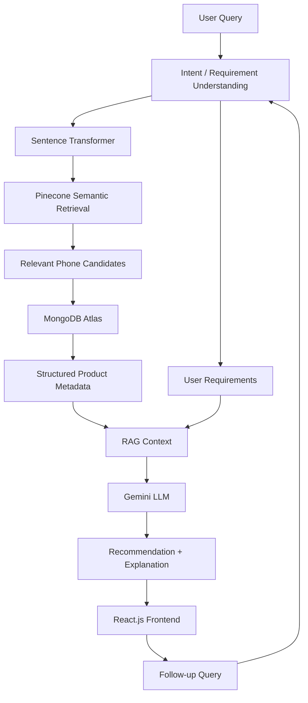
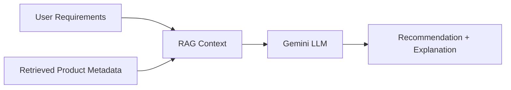

# ConvoShop

### A Retrieval-Augmented Generation Framework for Intent-Driven E-Commerce Product Advisory

ConvoShop is a conversational e-commerce product advisory system focused on **mobile phones**. It accepts natural-language requirements, retrieves relevant phone products using semantic search, fetches structured product metadata, and uses Retrieval-Augmented Generation (RAG) with a Gemini model to generate a conversational recommendation.

> **Current scope:** The implemented recommendation dataset documented here is for mobile phones. Laptop data is kept as a separate dataset area for future expansion and is not presented as part of the current phone recommendation scope.

## 1. Project Overview

Users can describe what they need without manually selecting multiple filters.

**Example**

> I need a phone with a good camera and battery life under ₹30,000.

The system processes the requirement, retrieves relevant phone candidates, obtains their structured metadata, and generates a recommendation using the retrieved information as context.

## 2. Objectives

- Understand mobile-phone requirements expressed in natural language.
- Extract requirements such as category, features, budget, and use case.
- Retrieve semantically relevant phone products.
- Retrieve structured product metadata for candidate products.
- Ground LLM responses using retrieved product information.
- Provide conversational product recommendations.
- Support follow-up queries when session context is available.

## 3. System Architecture

The following Mermaid diagram shows the main request-to-recommendation flow. GitHub renders Mermaid diagrams in Markdown, so this block is intentionally kept as `mermaid` code rather than as plain text.



### Component Responsibilities

| Component | Responsibility |
|---|---|
| **React.js** | Conversational frontend |
| **FastAPI** | Backend/API orchestration |
| **Intent / Requirement Understanding** | Converts the user request into retrieval requirements |
| **Sentence Transformer** | Creates semantic embeddings |
| **Pinecone** | Semantic vector retrieval |
| **MongoDB Atlas** | Stores and retrieves structured product metadata |
| **RAG** | Supplies retrieved product information as LLM context |
| **Gemini** | Generates the final recommendation and explanation |

## 4. Dataset

The current phone recommendation pipeline produces a cleaned dataset of **271 phone records** after the tablet-related data-cleaning fix.

The project uses structured product metadata. It does **not** claim that the data is live, verified, or based on live availability or review information.

### Dataset sources

#### 1. Kaggle — Mobiles Dataset (2025)

- **Source:** Abdul Malik — *Mobiles Dataset (2025)*
- **URL:** https://www.kaggle.com/datasets/abdulmalik1518/mobiles-dataset-2025
- **Use in project:** Source for mobile-phone specifications and launch-price information used in the phone cleaning pipeline.
- **License:** The Kaggle dataset page's license should be treated as authoritative. The accessible Kaggle rendering used for this README review did not expose the dataset-license field reliably, so the README does **not** incorrectly infer a license from Kaggle notebooks that use the dataset. In particular, an Apache 2.0 label shown on a Kaggle notebook is the notebook's license, not proof that the underlying dataset is Apache 2.0.

#### 2. Hugging Face — Nadirova/Phone_SpecsDataset_25K

- **Source:** Nadirova — *Phone_SpecsDataset_25K*
- **URL:** https://huggingface.co/datasets/Nadirova/Phone_SpecsDataset_25K
- **Use in project:** Phone/device specification and image-reference data where applicable.
- **License:** No dataset license is declared in the accessible dataset-card metadata for this repository. The dataset card describes 25,008 records and includes specification, market-information, source-URL, and image-URL fields. Because no explicit license was exposed, redistribution rights should be confirmed with the dataset author/source before committing a processed copy to a public repository.

### Dataset redistribution note

The repository is public. Therefore, raw or processed CSV/JSON copies should only be committed when the original dataset license and source terms clearly permit redistribution of derivative/processed data. Until the license for each source is confirmed, keep downloaded source files under `data/raw/` locally and keep that directory gitignored.

## 5. Retrieval Pipeline

### Step 1 — Requirement Understanding

A natural-language request is converted into useful requirements.

For example:

```text
Category  → Mobile Phone
Budget    → ₹30,000
Features  → Camera + Battery Life
```

The exact extraction/decomposition method is implementation-specific and should match the backend code.

### Step 2 — Semantic Embedding

The processed requirement is converted into a vector representation using the Sentence Transformer model configured for the project.

**Embedding model:** Use the exact model name configured in the backend and the same dimension configured for the Pinecone index. These values should be kept identical between indexing and query-time embedding.

### Step 3 — Pinecone Retrieval

The query embedding is used for semantic similarity search in Pinecone to retrieve relevant phone candidates.

Semantic similarity alone does **not** guarantee an exact numeric constraint such as `Price < ₹30,000`. If a separate metadata-price filter is implemented, that filter should be described from the backend implementation.

### Step 4 — MongoDB Retrieval

MongoDB Atlas is used to retrieve the structured product metadata associated with the selected candidates.

```text
Pinecone
   ↓
Relevant product candidates

MongoDB Atlas
   ↓
Structured product metadata
```

## 6. Retrieval-Augmented Generation

ConvoShop supplies retrieved product information to the LLM as context.



RAG helps ground the generated response in retrieved product information. It can reduce unsupported claims, but it does not guarantee that every generated statement is correct.

## 7. Recommendation Generation

The Gemini model receives the user requirements together with the retrieved product context and generates the final conversational response.

Recommendation and explanation are treated as **one LLM stage**. This README does not claim a separate ranking engine unless such a module exists in the implementation.

## 8. Example Interaction

**User**

> I need a phone with a good camera and battery life under ₹30,000.

**System interpretation**

```text
Product Category  → Mobile Phone
Budget            → ₹30,000
Required Features → Camera + Battery Life
```

**Retrieval**

```text
Requirements
     ↓
Sentence Transformer
     ↓
Pinecone
     ↓
Phone Candidates
     ↓
MongoDB
     ↓
Structured Product Metadata
```

**Generation**

```text
User Requirements + Retrieved Metadata
                 ↓
             RAG Context
                 ↓
             Gemini LLM
                 ↓
        Recommendation + Explanation
```

## 9. Conversational Follow-up

When session context is available, users can continue a conversation without repeating the complete requirement.

```text
User: Recommend a phone under ₹30,000 with a good camera.

System: [Recommendations]

User: Which one has the best battery?

System: [Follow-up response]
```

Follow-up handling should preserve the relevant conversation context and use the updated requirement when a new retrieval is needed. The exact storage mechanism should match the backend implementation.

## 10. Technology Stack

- **Frontend:** React.js
- **Backend:** FastAPI
- **Embeddings:** Sentence Transformer
- **Vector Search:** Pinecone
- **Database:** MongoDB Atlas
- **Generative AI:** Gemini model configured by the backend
- **Architecture:** Retrieval-Augmented Generation (RAG)

### Gemini model

The final README should use the **exact model string from the backend configuration**. The previous `Gemini 1.5 Flash` wording has intentionally been removed because the backend source was not available for verification in this README revision.

## 11. Repository Structure

```text
final_year/
├── Frontend/
│   └── my-react-app/
├── Phone_Datasets/
├── Laptop_Datasets/
├── src/
│   └── cleaning/
│       └── ...                 # data cleaning / preprocessing pipeline
├── data/
│   └── raw/                    # downloaded source data; gitignored
├── .env.example
├── README.md
└── Backend/                    # add when the backend directory is committed
```

### Current data scope

- `Phone_Datasets/` contains the phone-related project data.
- `Laptop_Datasets/` is kept separate and is **not part of the current phone recommendation scope**.
- `src/cleaning/` contains the project's data-cleaning/preprocessing code, including the pipeline used to prepare the phone data.
- `Backend/` should only be listed as an actual application directory after it has been committed to the repository. If it is not yet present, create it or remove it from the tree until it exists.

## 12. Setup

### Prerequisites

- Python 3.x
- Node.js and npm
- MongoDB Atlas configuration
- Pinecone configuration
- Gemini API access

### Clone the repository

```bash
git clone https://github.com/Veenashree22533/final_year.git
cd final_year
```

### Data pipeline

The source datasets should be downloaded by each team member separately because `data/raw/` is gitignored.

A typical pipeline is:

```text
Download source datasets
        ↓
Place source files under data/raw/
        ↓
Run the cleaning/preprocessing code in src/cleaning/
        ↓
Run build_descriptions.py
        ↓
Cleaned phone descriptions / records
        ↓
Load the prepared data into the project's retrieval/database pipeline
```

From the directory containing `build_descriptions.py`, run:

```bash
python build_descriptions.py
```

The final cleaning run should report **271 phone records** after the tablet fix.

> Do not commit the original downloaded datasets to `data/raw/` unless their licenses and source terms explicitly allow redistribution.

### Backend

If the backend directory is present in the repository:

```powershell
cd Backend
python -m venv venv
venv\Scripts\activate
pip install -r requirements.txt
```

### Frontend

```bash
cd Frontend/my-react-app
npm install
npm run dev
```

### Environment variables

Never commit API keys, passwords, or other secrets to GitHub.

The repository should provide an `.env.example` file containing variable names but no secret values. Configure the corresponding values in a local `.env` file.

Required variables include:

```text
MONGODB_URI
MONGODB_DB
PINECONE_API_KEY
PINECONE_INDEX
GEMINI_API_KEY
```

Use the exact names from the backend configuration if they differ from the names above.

## 13. Evaluation

The README does not claim quantitative improvements unless those experiments have actually been performed.

Useful evaluation measures include:

- Retrieval relevance
- Precision@K
- Recall@K
- Budget-constraint accuracy
- Recommendation quality
- Comparison with keyword-based search
- Comparison with a standalone LLM
- User evaluation

## 14. Limitations

- **Launch-price data:** Prices in the current phone dataset are launch prices, not live/current retail prices.
- **Source-data errors:** Public source data can contain incorrect specifications. For example, the Kaggle-derived data lists the iPhone 16 with an **A17 Bionic** processor, whereas the actual iPhone 16 uses the A18 chip. Such source errors can therefore propagate into retrieved metadata and recommendations.
- **Partial image coverage:** Images are available for only some phones; the system cannot display a source image when an image reference is missing.
- Semantic similarity alone does not guarantee exact numeric constraints such as price unless explicit metadata filtering is implemented.
- Recommendation quality depends on the coverage and quality of the source data.
- Products absent from the knowledge base cannot be recommended.
- LLM-generated explanations can still contain errors.

## 15. Future Scope

- Add the laptop dataset as a supported product category after documenting its source, currency, time period, and limitations.
- Improve requirement and intent extraction.
- Add robust numeric and metadata filtering.
- Improve retrieval and re-ranking.
- Expand the product dataset.
- Add additional product categories.
- Add real-time product information where appropriate.
- Evaluate retrieval and recommendation quality using standard metrics.
- Compare against keyword search and a standalone LLM baseline.
- Improve conversational memory.

## 16. Conclusion

ConvoShop combines natural-language requirement understanding, semantic product retrieval, structured product metadata, Retrieval-Augmented Generation, and LLM reasoning for conversational mobile-phone recommendations.

The core workflow is:

```text
Understand the requirement
        ↓
Retrieve relevant phones
        ↓
Fetch structured product metadata
        ↓
Ground the LLM with retrieved context
        ↓
Generate the recommendation and explanation
```

## 17. Project Information

**ConvoShop: A Retrieval-Augmented Generation Framework for Intent-Driven E-Commerce Product Advisory**

Academic final-year project focused on conversational, intent-driven mobile-phone recommendation using semantic retrieval and RAG.

### Team and Guide

Add the project team members and project guide here.

### Project License

No open-source license is claimed for the project itself unless a `LICENSE` file is added to the repository. Dataset licenses are separate from the software license and must be respected independently.

## Repository About Box

Use the following GitHub repository description:

> **ConvoShop — RAG-based conversational mobile-phone recommendation using FastAPI, Pinecone, MongoDB Atlas, Sentence Transformers, and Gemini.**

Suggested GitHub topics:

```text
rag
fastapi
pinecone
mongodb
recommendation-system
semantic-search
sentence-transformers
gemini
conversational-ai
e-commerce
mobile-recommendation
```
